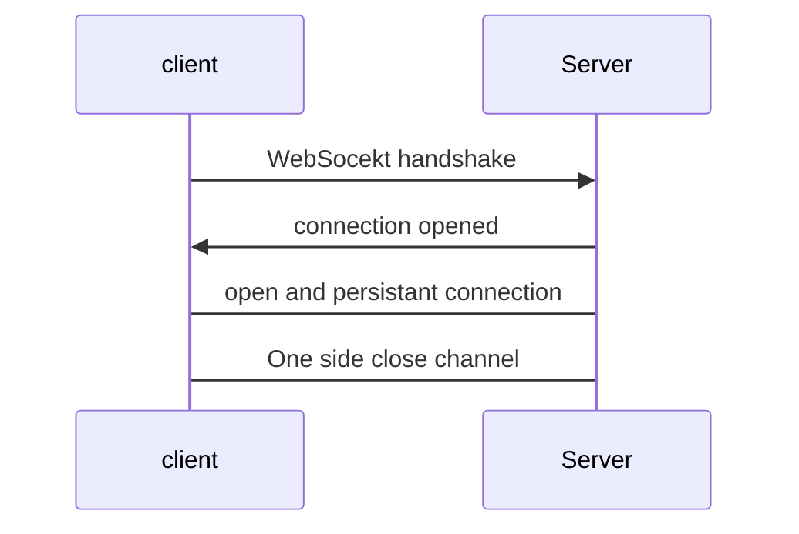

#  ELB  웹소켓 스케일아웃?

# ELB WebSocket Scale Out?

- 웹소켓은 스케일 아웃이 되는가?
- 특정상황 -> 스케일 아웃된 Web Server  두개에 REST  요청이 오면 Server 에 접속된 모든 Client 에게 메시지 를 보내야됨.. 
- 결론- 안됨...
- 밑은 이유와 구현 방식.


## 웹소켓의 동작 방식





1. client  가 서버의 endpoint 에 접근에 handshake 를 시도한다.
2. 요청이 맞다면 Server 는 클라이언트 에게 connection 을 오픈함.
3. 이 때 연결이 되는데 일반적인 http 연결이 아닌 TCP 커넥션을 사용함.


### 이런식의 커넥션 요청

```
GET/... HTTP/1.1
Upgrade: WebSocket
Connection: Upgrade
...
```


## 왜 안될까? (나의경우)

```merma
graph LR
A[Hard edge] -->B(Round edge)
    B --> C{Decision}
    C -->|One| D[Result one]
    C -->|Two| E[Result two]
```


**3.이 때 연결이 되는데 일반적인 http 연결이 아닌 TCP 커넥션을 사용함.**

-> 서버와 직접연결됨 (한서버와... )