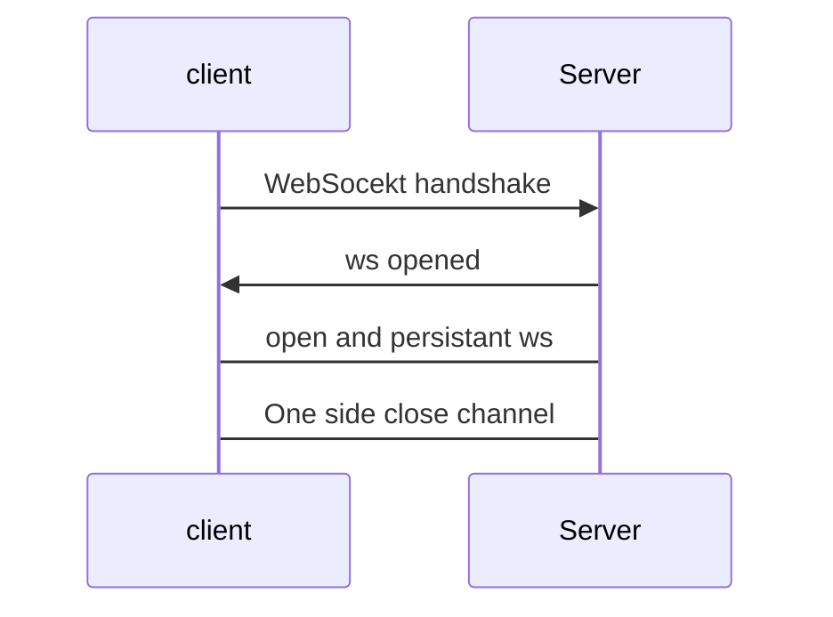
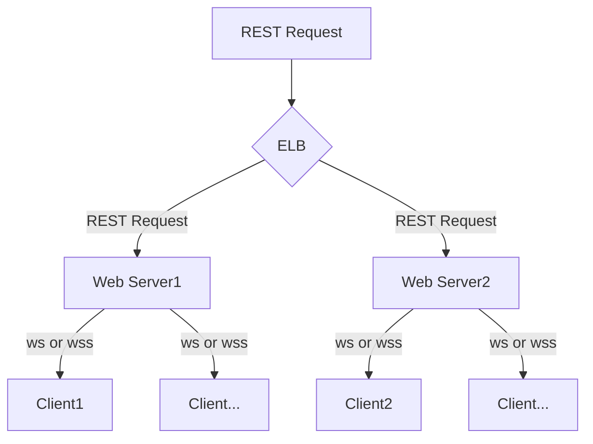
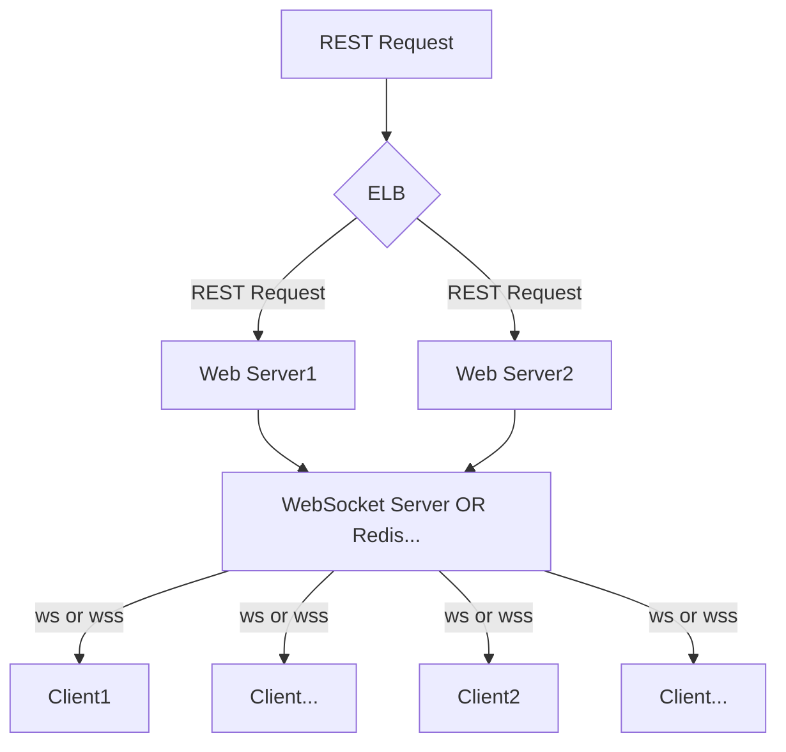
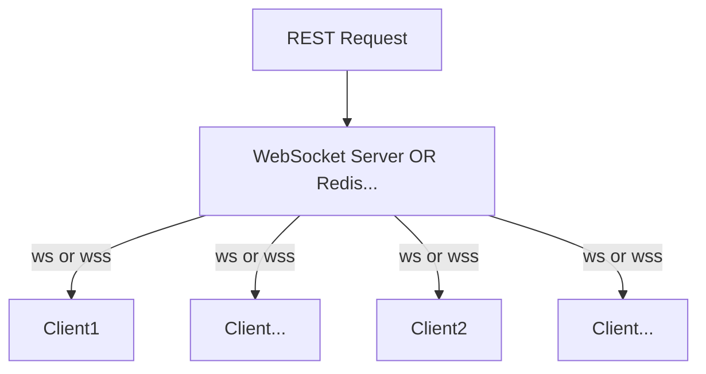

#  ELB  웹소켓 스케일아웃?

# ELB WebSocket Scale Out?

- 웹소켓은 스케일 아웃이 되는가?
- 특정상황 -> 스케일 아웃된 Web Server  두개에 REST  요청이 오면 Server 에 접속된 모든 Client 에게 메시지 를 보내야됨..
- 결론- 안됨...
- 밑은 이유와 구현 방식.


## 웹소켓의 동작 방식




1. client  가 서버의 endpoint 에 접근에 handshake 를 시도한다.
2. 요청이 맞다면 Server 는 클라이언트 에게 ws 을 오픈함.
3. 이 때 연결이 되는데 일반적인 http 연결이 아닌 TCP 커넥션을 사용함.

### 이런식의 커넥션 요청

```
GET/... HTTP/1.1
Upgrade: WebSocket
ws: Upgrade
...
```

## 왜 안될까? (나의경우)


- 특정 REST Request 가 오면 모든 소켓에 접속한 모든 클라이언트에게 메시지를 보내야함.

- 위 Flow Chart 처럼 서버를 구성하면 모든 클라이언트에게 메세지를 보내지 못함

- **3.이 때 연결이 되는데 일반적인 http 연결이 아닌 TCP 커넥션을 사용함.**-> client 들은 서버와 직접연결됨 (한서버와... )


## 결국


### or



 - 클라이언트와 서버간의 소켓을 관리하는 하나의 레이어가 더 필요함.
 - 나의 경우는(요청이 그리 많지 않음)
위 웹 Web Server1,2 의 레이어를 걷어내고 하나의 Request 만 웹소켓 서버에 요청하게 만들어놨음
